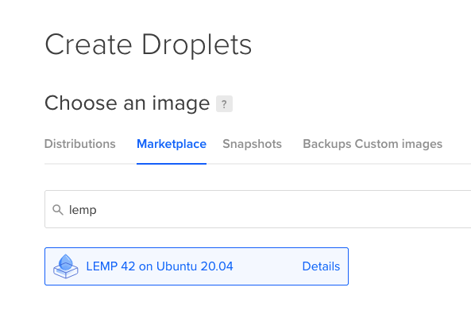

# These are some configs for getting Nginx and Varnish working for https. It also has the redirects to forward all traffic to https://wwww. 

These are my configs from an Ubuntu LEMP Digital Ocean Droplet. 



The files are:
- default.vcl
- nginx.conf
- varnish_daemon.txt
- varnish.service


## default.vcl

```
vcl 4.1;

import std;

backend projectname {
    .host = "127.0.0.1";
    .port = "8080";
    .max_connections = 100;
    .connect_timeout        = 5s;
    .first_byte_timeout     = 90s;
    .between_bytes_timeout  = 2s;
}

acl purge {
    "localhost";
    "127.0.0.1";
    "::1";
}

sub vcl_recv {
    if (req.url ~ "^/\.well-known/acme-challenge/") {
        set req.backend_hint = projectname;
        return(pipe);
    }
    

    # Forward client's IP to the backend
    if (req.restarts == 0) {
        if (req.http.X-Real-IP) {
            set req.http.X-Forwarded-For = req.http.X-Real-IP;
        } else if (req.http.X-Forwarded-For) {
            set req.http.X-Forwarded-For = req.http.X-Forwarded-For + ", " + client.ip;
        } else {
            set req.http.X-Forwarded-For = client.ip;
        }
    }


    set req.http.Host = regsub(req.http.Host, ":[0-9]+", "");
    unset req.http.proxy;
    set req.url = std.querysort(req.url);
    set req.url = regsub(req.url, "\?$", "");
    set req.http.Surrogate-Capability = "key=ESI/1.0";

    if (std.healthy(req.backend_hint)) {
        set req.grace = 10s;
    }

    if (!req.http.X-Forwarded-Proto) {
        if(std.port(server.ip) == 443) {
            set req.http.X-Forwarded-Proto = "https";
        } else {
            set req.http.X-Forwarded-Proto = "https";
        }
    }

    # === STATIC FILES ===
    # Properly handle different encoding types
    if (req.http.Accept-Encoding) {
        if (req.url ~ "\.(jpg|jpeg|png|gif|gz|tgz|bz2|tbz|mp3|ogg|swf)$") {
            # No point in compressing these
            unset req.http.Accept-Encoding;
        } elseif (req.http.Accept-Encoding ~ "gzip") {
            set req.http.Accept-Encoding = "gzip";
        } elseif (req.http.Accept-Encoding ~ "deflate") {
            set req.http.Accept-Encoding = "deflate";
        } else {
            # unknown algorithm (aka crappy browser)
            unset req.http.Accept-Encoding;
        }
    }

    if (req.http.Upgrade ~ "(?i)websocket") {
        return (pipe);
    }

    if (req.url ~ "(\?|&)(utm_source|utm_medium|utm_campaign|utm_content|gclid|cx|ie|cof|siteurl)=") {
        set req.url = regsuball(req.url, "&(utm_source|utm_medium|utm_campaign|utm_content|gclid|cx|ie|cof|siteurl)=([A-z0-9_\-\.%25]+)", "");
        set req.url = regsuball(req.url, "\?(utm_source|utm_medium|utm_campaign|utm_content|gclid|cx|ie|cof|siteurl)=([A-z0-9_\-\.%25]+)", "?");
        set req.url = regsub(req.url, "\?&", "?");
        set req.url = regsub(req.url, "\?$", "");
    }

    if (req.method == "PURGE") {
        if (!client.ip ~ purge) {
            return (synth(405, client.ip + " is not allowed to send PURGE requests."));
        }
        return (purge);
    }

    if (req.method != "GET" &&
        req.method != "HEAD" &&
        req.method != "PUT" &&
        req.method != "POST" &&
        req.method != "TRACE" &&
        req.method != "OPTIONS" &&
        req.method != "PATCH" &&
        req.method != "DELETE") {
        return (pipe);
    }

    if (req.method != "GET" && req.method != "HEAD") {
        return (pass);
    }

    if (req.url ~ "^[^?]*\.(7z|avi|bmp|bz2|css|csv|doc|docx|eot|flac|flv|gif|gz|ico|jpeg|jpg|js|less|mka|mkv|mov|mp3|mp4|mpeg|mpg|odt|ogg|ogm|opus|otf|pdf|png|ppt|pptx|rar|rtf|svg|svgz|swf|tar|tbz|tgz|ttf|txt|txz|wav|webm|webp|woff|woff2|xls|xlsx|xml|xz|zip)(\?.*)?$") {
        unset req.http.Cookie;
        return(hash);
    }

    set req.http.Cookie = regsuball(req.http.Cookie, "(__utm|_ga|_opt)[a-z_]*=[^;]+(; )?", "");
    set req.http.Cookie = regsuball(req.http.Cookie, "(__)?hs[a-z_\-]+=[^;]+(; )?", "");
    set req.http.Cookie = regsuball(req.http.Cookie, "hubspotutk=[^;]+(; )?", "");
    set req.http.Cookie = regsuball(req.http.Cookie, "_hj[a-zA-Z]+=[^;]+(; )?", "");
    set req.http.Cookie = regsuball(req.http.Cookie, "(NID|DSID|__gads|GED_PLAYLIST_ACTIVITY|ACLK_DATA|ANID|AID|IDE|TAID|_gcl_[a-z]*|FLC|RUL|PAIDCONTENT|1P_JAR|Conversion|VISITOR_INFO1[a-z_]*)=[^;]+(; )?", "");
    set req.http.Cookie = regsuball(req.http.Cookie, "^;\s*", "");

    if (req.http.cookie ~ "^\s*$") {
        unset req.http.cookie;
    }
}

sub vcl_pipe {
    if (req.backend_hint == projectname) {
        set req.http.Connection = "close";
        return(pipe);
    }
}

sub vcl_hash {
    hash_data(req.http.X-Forwarded-Proto);
}

sub vcl_backend_response {
    if (bereq.url ~ "^[^?]*\.(7z|avi|bmp|bz2|css|csv|doc|docx|eot|flac|flv|gif|gz|ico|jpeg|jpg|js|less|mka|mkv|mov|mp3|mp4|mpeg|mpg|odt|ogg|ogm|opus|otf|pdf|png|ppt|pptx|rar|rtf|svg|svgz|swf|tar|tbz|tgz|ttf|txt|txz|wav|webm|webp|woff|woff2|xls|xlsx|xml|xz|zip)(\?.*)?$") {
        unset beresp.http.Set-Cookie;
        set beresp.ttl = 1d;
    }

    if (beresp.http.Surrogate-Control ~ "ESI/1.0") {
        unset beresp.http.Surrogate-Control;
        set beresp.do_esi = true;
    }

    # Unset the "pragma" header (suggested)
    unset beresp.http.Pragma;

    # Unset the "vary" header (suggested)
    unset beresp.http.Vary;

    set beresp.ttl = 10s;
    set beresp.grace = 2h;
}
```


## nginx.conf

```
user www-data;
worker_processes auto;
worker_rlimit_nofile 38000;
pid /run/nginx.pid;
include /etc/nginx/modules-enabled/*.conf;

events {
	worker_connections 768;
}

http {
	sendfile on;
	autoindex off;
	tcp_nopush on;
	tcp_nodelay on;
	keepalive_timeout 65;
	reset_timedout_connection on;
	keepalive_requests 100000;
	types_hash_max_size 2048;
	server_tokens off;
	server_names_hash_bucket_size 64;
	charset UTF-8;
	
	# Cloudflare IP's
	set_real_ip_from 173.245.48.0/20;
	set_real_ip_from 103.21.244.0/22;
	set_real_ip_from 103.22.200.0/22;
	set_real_ip_from 103.31.4.0/22;
	set_real_ip_from 141.101.64.0/18;
	set_real_ip_from 108.162.192.0/18;
	set_real_ip_from 190.93.240.0/20;
	set_real_ip_from 188.114.96.0/20;
	set_real_ip_from 197.234.240.0/22;
	set_real_ip_from 198.41.128.0/17;
	set_real_ip_from 162.158.0.0/15;
	set_real_ip_from 104.16.0.0/12;
	set_real_ip_from 172.64.0.0/13;
	set_real_ip_from 131.0.72.0/22;
	set_real_ip_from 2400:cb00::/32;
	set_real_ip_from 2606:4700::/32;
	set_real_ip_from 2803:f800::/32;
	set_real_ip_from 2405:b500::/32;
	set_real_ip_from 2405:8100::/32;
	set_real_ip_from 2a06:98c0::/29;
	set_real_ip_from 2c0f:f248::/32;

	real_ip_header X-Forwarded-For;

	client_max_body_size 128m;

	client_body_buffer_size 2m;
	client_header_buffer_size 64k;
	large_client_header_buffers 16 128k;

	fastcgi_buffers 4 32k;
	fastcgi_buffer_size 32k;
	fastcgi_busy_buffers_size 32k;

	fastcgi_connect_timeout 60s;
	fastcgi_next_upstream_timeout 40s;
	fastcgi_next_upstream_tries 10;
	fastcgi_read_timeout 60s;
	fastcgi_send_timeout 60s;
	fastcgi_cache_lock_timeout 60s;

	open_file_cache max=35000 inactive=30s;
	open_file_cache_valid 30s;
	open_file_cache_min_uses 2;

	include /etc/nginx/mime.types;
	default_type application/octet-stream;

	ssl_protocols TLSv1 TLSv1.1 TLSv1.2 TLSv1.3;
	ssl_prefer_server_ciphers on;

	access_log /var/log/nginx/access.log;
	error_log /var/log/nginx/error.log;


	gzip on;
	gzip_vary on;
	gzip_proxied any;
	gzip_disable "msie6";

	gzip_min_length 10240;
	#gzip_min_length 1000;
	gzip_buffers 4 16k;
	gzip_comp_level 6;
	gzip_types text/css text/js text/xml text/plain text/javascript
		text/html
		text/x-component
		application/json
		application/xml
		application/x-javascript
		application/javascript
		application/vnd.ms-fontobject
		application/rss+xml
		font/truetype
		font/opentype
		image/svg+xml;

	map_hash_max_size 4200;
	map_hash_bucket_size 4200;

	log_format main
		'$remote_addr - $remote_user [$time_local] "$request" '
		'$status $body_bytes_sent "$http_referer" '
		'"$http_user_agent" "$http_x_forwarded_for"';

	map $http_user_agent $is_non_search_bot {
		default '';
		~*(google|bing|pingdom|monitis.com|Zend_Http_Clienti) '';
		~*(http|crawler|spider|bot|search|ForusP|Wget/|Python-urllib|PHPCrawl|bGenius) 'bot';
	}

	map $status $write_log {
		444 0;
		default 1;
	}

	map $http_user_agent $is_bad_client {
		default 0;
		~*(Sogou) 1;
		~*(360Spider) 1;
		~*(aiHitBot|AhrefsBot) 1;
		~*(betaBot|BlackWidow|Bolt|BLEXBot|BUbiNG) 1;
		~*(CazoodleBot|CPython|CCBot|ChinaClaw|Curious|CRAZYWEBCRAWLER|Custo) 1;
		~*(Default|DIIbot|DISCo|discobot) 1;
		~*(Exabot|eCatch|ecxi|EirGrabber|EmailCollector|EmailSiphon|EmailWolf|ExtractorPro|EyeNetIE) 1;
		~*(FlashGet|Findxbot) 1;
		~*(GetRight|GetWeb!|Go!Zilla|Go-Ahead-Got-It|Go.*package.*|GrabNet|Grafula|GT::WWW|GuzzleHttp) 1;
		~*(heritrix|HaosouSpider|HMView|HTTP::Lite|HTTrack) 1;
		~*(ia_archiver|IDBot|id-search|id-search.org|InterGET|InternetSeer.com|IRLbot) 1;
		~*(JetCar) 1;
		~*(larbin|LeechFTP|Lightspeedsystems|litemage_walker|LinksManager.com_bot|Lipperhey|linkwalker|LinkpadBot|lwp-trivial|ltx71) 1;
		~*(Maxthon$|Mail.RU_Bot|MegaIndex.ru|meanpathbot|MFC_Tear_Sample|microsoft.url|Microsoft-IIS|Mozilla.*Indy|Mozilla.*NEWT|MJ12bot|MSFrontPage) 1;
		~*(Navroad|NearSite|NetAnts|NetLyzer.*FastProbe|NetSpider|NetZIP|Nutch) 1;
		~*(Octopus) 1;
		~*(PageGrabber|panscient.com|pavuk|PECL::HTTP|PeoplePal|pcBrowser|Pi-Monster|PHPCrawl|PleaseCrawl|psbot|prijsbest|python-requests) 1;
		~*(Qwantify) 1;
		~*(RealDownload|ReGet|RedesScrapy|Rippers|RocketCrawler) 1;
		~*(SBIder|Scrapy|Screaming|ScreenerBot|SEOprofiler|SeaMonkey$|SeznamBot|SemrushBot|sitecheck.internetseer.com|SiteSnagger) 1;
		~*(SmartDownload|Snoopy|SputnikBot|Steeler|SuperBot|SuperHTTP|Surfbot|sqlmap) 1;
		~*(tAkeOut|Teleport|Toata|TwengaBot|Typhoeus) 1;
		~*(URI::Fetch|User-Agent|UserAgent) 1;
		~*(voltron|Vagabondo|VoidEYE|Visbot) 1;
		~*(webalta|WebAuto|[Ww]eb[Bb]andit|WebCollage|WebCopier|WebFetch|WebLeacher|WebReaper|WebSauger|WebStripper|WebWhacker|WhatsApp) 1;
		~*(WebZIP|Wget|Widow|Wotbox|WWW-Mechanize|WWWOFFLE) 1;
		~*(zermelo|Zeus|Zeus.*Webster|ZyBorg) 1;
	}

	map $uri $redirected_url {
		default "none";
	}

	limit_req_zone $binary_remote_addr zone=one:10m rate=30r/s;
	limit_req_zone $is_non_search_bot zone=bots:10m rate=22r/s;

	limit_req_log_level error;

	index index.php index.html;

	upstream fastcgi_backend {
		server unix:/var/run/php/php5.6-fpm.sock;
	}

	proxy_cache_path /var/cache/varnish levels=1:2 keys_zone=my_cache:8m max_size=1g inactive=60m use_temp_path=off;


	server {
		# redirect http to https://wwww
		listen 8080;
		listen [::]:8080;
		server_name example.com;
		return 301 https://example.com$request_uri;
	}
	server {
		listen 8080;
		listen [::]:8080;
		root /var/www/current/default_site;

		server_name example.com;

		location / {
			try_files $uri $uri/ /index.php?q=$uri&$args;
		}

		error_page 404 /404.html;
		error_page 500 502 503 504 /50x.html;
		location = /50x.html {
			root /usr/share/nginx/html;
		}

		location ~ \.php$ {
			include snippets/fastcgi-php.conf;
			fastcgi_pass unix:/run/php/php5.6-fpm.sock;
		}
	}

	server {
		# redirect https:// to https://wwww
		listen 443;
		listen [::]:443;
		server_name example.com;
		ssl_certificate /etc/letsencrypt/live/example.com/fullchain.pem; # managed by Certbot
		ssl_certificate_key /etc/letsencrypt/live/example.com/privkey.pem; # managed by Certbot
		include /etc/letsencrypt/options-ssl-nginx.conf; # managed by Certbot
		ssl_dhparam /etc/letsencrypt/ssl-dhparams.pem; # managed by Certbot
		return 301 https://example.com$request_uri;
	}

	server {
		listen [::]:443 ssl http2;
		listen 443 ssl;
		root /var/www/current/default_site;
		server_name example.com;
		ssl_certificate /etc/letsencrypt/live/example.com/fullchain.pem; # managed by Certbot
		ssl_certificate_key /etc/letsencrypt/live/example.com/privkey.pem; # managed by Certbot
		include /etc/letsencrypt/options-ssl-nginx.conf; # managed by Certbot
		ssl_dhparam /etc/letsencrypt/ssl-dhparams.pem; # managed by Certbot

		ssl_session_cache shared:SSL:10m;
		add_header Strict-Transport-Security "max-age=31536000; includeSubDomains";
		add_header "X-XSS-Protection" "1; mode=block";

		if ($request_uri ~* "^(.*/)index\.php(/?)(.*)" ) {
			return 301 $1$3;
		}

		if ($is_bad_client) {
			return 444;
		}

		location ~* \.(ico|jpg|jpeg|png|gif|svg)$ {
			access_log off;
			add_header Cache-Control "public";
			add_header X-Frame-Options SAMEORIGIN always;
			expires 365d;
		}
		
		location ~* \.(js|css|pdf)$ {
			expires 365d;
			access_log off;
			add_header Cache-Control "public";
			add_header X-Frame-Options SAMEORIGIN always;
			add_header Access-Control-Allow-Origin "https://fast.fonts.net";
		}

		location ~* \.(html|swf)$ {
            expires 30d;
			add_header Cache-Control "public";
			add_header X-Frame-Options SAMEORIGIN always;
		}

		location ~* \.(eot|ttf|otf|woff|woff2)$ {
			access_log off;
			add_header Cache-Control "public, no-transform";
			add_header X-Frame-Options SAMEORIGIN always;
			expires 365d;
		}

		location = /favicon.ico {
			log_not_found off;
			access_log off;
		}

		location = /robots.txt {
			allow all;
			log_not_found off;
			access_log off;
		}

		location / {
			proxy_cache my_cache;
			proxy_cache_revalidate on;
			proxy_cache_min_uses 3;
			proxy_cache_use_stale error timeout updating http_500 http_502 http_503 http_504;
			proxy_cache_background_update on;
			proxy_cache_lock on;

			proxy_ignore_headers X-Accel-Expires;
			proxy_ignore_headers Expires;
			proxy_ignore_headers Cache-Control;

			proxy_pass http://127.0.0.1:80;
			# ALSO TRY YOUR SERVER IP proxy_pass http://99.100.101.102:80;
			proxy_set_header X-Real-IP $remote_addr;
			proxy_set_header X-Forwarded-For $proxy_add_x_forwarded_for;
			proxy_set_header X-Forwarded-Proto https;
			proxy_set_header X-Forwarded-Port 443;
			proxy_set_header Host $host;
		}
		error_page 404 /404.html;
		error_page 500 502 503 504 /50x.html;
		location = /50x.html {
			root /usr/share/nginx/html;
		}

		location ~ \.php$ {
			include snippets/fastcgi-php.conf;
			fastcgi_pass unix:/run/php/php5.6-fpm.sock;
		}
	
	}
}
```

## varnish_daemon.txt
This is the code from "nano /etc/default/varnish"

```
DAEMON_OPTS="-a :80 \
    -T localhost:6082 \
    -p feature=+http2 \
    -f /etc/varnish/default.vcl \
    -S /etc/varnish/secret \
    -s malloc,1g"
```

## varnish.service
This is the code from "nano /lib/systemd/system/varnish.service"

```
[Unit]
Description=Varnish HTTP accelerator
Documentation=https://www.varnish-cache.org/docs/6.1/ man:varnishd

[Service]
Type=simple
LimitNOFILE=131072
LimitMEMLOCK=82000
ExecStart=/usr/sbin/varnishd -j unix,user=vcache -F -a :80 -T localhost:6082 -f /etc/varnish/default.vcl -S /etc/varnish/secret -p feature=+http2 -s malloc,1G
ExecReload=/usr/share/varnish/varnishreload
ProtectSystem=full
ProtectHome=true
PrivateTmp=true
PrivateDevices=true

[Install]
WantedBy=multi-user.target
```

